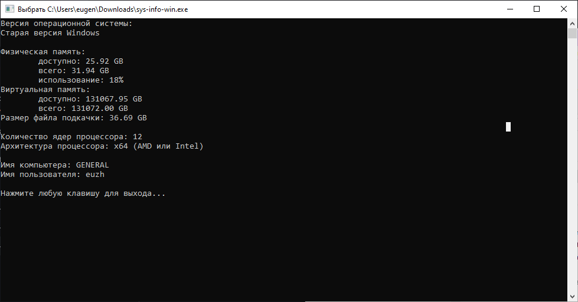
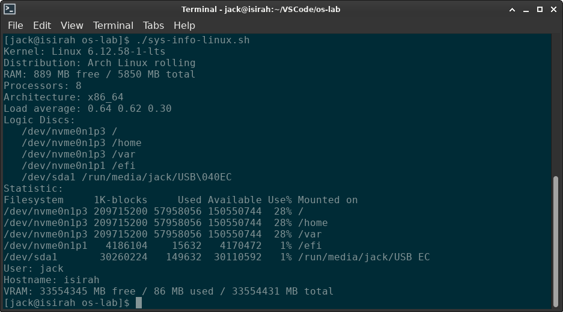

# Лабораторная работа №1 по предмету "Операционные системы". Преподаватель Данилов А. С.

# Студент: Чугаев Е. И. ИТ-5-2024

## Задание 1 — sys-info-win

*Примеры приведены для С++, но вы можете использовать любой другой язык, где можно использовать Win32 API.*

Научиться работать с Windows API для получения системной информации, реализовать структурированный и надёжный код, который:

- Обрабатывает все возможные ошибки корректно,
- Даёт студенту понимание, как устроена система "под капотом".

Напишите программу sys-info-win для ОС Windows, которая бы выводила в консоль информацию о компьютере на котором она запущена:

- Версия операционной системы.
  - Используйте IsWindows10OrGreater() и аналоги из VersionHelpers.h
- Размер виртуальной и физической памяти, а также использование памяти в процентах.
- Количество ядер процессора
- Имя компьютера и имя пользователя
- Архитектура процессора (x86, x64, ARM)
- Размер файла подкачки (функция `GetPerformanceInfo`)
- Список логических дисков + их объёмы

#### Пример выводимой информации

```txt
OS: Windows 10 or Greater
Computer Name: DESKTOP-12345
User: Ivan Ivanov
Architecture: x64 (AMD64)
RAM: 6417MB / 7796MB
Virtual Memory: 16000MB
Memory Load: 47%
Pagefile: 20480MB / 32000MB

Processors: 16
Drives:
  - C:\  (NTFS): 114 GB free / 237 GB total
  - D:\  (NTFS): 80 GB free / 100 GB total
```

### Результаты запусков (скрины)



### Выводы

Программа работает корректно

### Код (sys-info-win.cpp)

```
//x86_64-w64-mingw32-g++ -o sys-info-win.exe sys-info-win.cpp -lpsapi -lnetapi32
#include <windows.h>
#include <stdio.h>
#include <tchar.h>
#include <psapi.h>
#include <versionhelpers.h>
#include <lm.h>

#pragma comment(lib, "psapi.lib")

void OS() {
    printf("Версия операционной системы:\n");
  
    if (IsWindows10OrGreater()) {
        printf("Windows 10 или новее\n");
    } else {
        printf("Старая версия Windows\n");
    }
    printf("\n");
}

void Mem() {   
    MEMORYSTATUSEX memInfo;
    memInfo.dwLength = sizeof(MEMORYSTATUSEX);
  
    if (GlobalMemoryStatusEx(&memInfo)) {
        printf("Физическая память:\n");
        printf("\tдоступно: %.2f GB\n", (double)memInfo.ullAvailPhys / (1024 * 1024 * 1024));
        printf("\tвсего: %.2f GB\n", (double)memInfo.ullTotalPhys / (1024 * 1024 * 1024));
        printf("\tиспользование: %ld%%\n", memInfo.dwMemoryLoad);
      
        printf("Виртуальная память:\n");
        printf("\tдоступно: %.2f GB\n", (double)memInfo.ullAvailVirtual / (1024 * 1024 * 1024));
        printf("\tвсего: %.2f GB\n", (double)memInfo.ullTotalVirtual / (1024 * 1024 * 1024));
    }

    PERFORMANCE_INFORMATION perfInfo;
    perfInfo.cb = sizeof(PERFORMANCE_INFORMATION);
  
    if (GetPerformanceInfo(&perfInfo, sizeof(PERFORMANCE_INFORMATION))) {
        printf("Размер файла подкачки: %.2f GB\n", 
               (double)(perfInfo.PageSize * perfInfo.CommitLimit) / (1024 * 1024 * 1024));
    }
    printf("\n");
}

void Proc() {
  
    SYSTEM_INFO sysInfo;
    GetSystemInfo(&sysInfo);
  
    printf("Количество ядер процессора: %lu\n", sysInfo.dwNumberOfProcessors);
  
    printf("Архитектура процессора: ");
    switch (sysInfo.wProcessorArchitecture) {
        case PROCESSOR_ARCHITECTURE_AMD64:
            printf("x64 (AMD или Intel)\n");
            break;
        case PROCESSOR_ARCHITECTURE_ARM:
            printf("ARM\n");
            break;
        case PROCESSOR_ARCHITECTURE_ARM64:
            printf("ARM64\n");
            break;
        case PROCESSOR_ARCHITECTURE_IA64:
            printf("Intel Itanium\n");
            break;
        case PROCESSOR_ARCHITECTURE_INTEL:
            printf("x86\n");
            break;
        default:
            printf("Неизвестная архитектура\n");
    }
    printf("\n");
}

void PC() {
    TCHAR computerName[MAX_COMPUTERNAME_LENGTH + 1];
    DWORD size = sizeof(computerName) / sizeof(TCHAR);
  
    if (GetComputerName(computerName, &size)) {
        _tprintf(_T("Имя компьютера: %s\n"), computerName);
    }
  
    TCHAR userName[256];
    DWORD userNameSize = sizeof(userName) / sizeof(TCHAR);
  
    if (GetUserName(userName, &userNameSize)) {
        _tprintf(_T("Имя пользователя: %s\n"), userName);
    }
    printf("\n");
}

void LogicDiscs() {

}

int main() {
    SetConsoleOutputCP(CP_UTF8);
  
    OS();
    Mem();
    Proc();
    PC();
    LogicDiscs();
  
    printf("Нажмите любую клавишу для выхода...");
    getchar();
  
    return 0;
}
```

## Задание 2 — sys-info-linux

Напишите программу sys-info-linux для ОС Linux, которая бы выводила в консоль информацию о компьютере, на котором запущена:

- Версия ядра и дистрибутива
  - Используйте `uname()` для ядра
  - Используйте `lsb_release()` или чтение `/etc/os-release`
- Количество свободной и имеющейся оперативной памяти (в мегабайтах)
  - Используйте `sysinfo` или парсинг `/proc/meminfo`.
- Количество логических процессоров (`get_nprocs()`)
- Архитектура процессора
  - Используйте `uname().machine`
- Загрузка процессора (из sysinfo.loads) или `/proc/loadavg`.
- Список подключенных логических дисков
  - прочитать `/proc/mounts` или вызывать `getmntent`.
  - Получить статистику через `statvfs()`
- Информация о текущем пользователе и hostname
  - `getlogin()`, `gethostname()` или `getpwuid(getuid())`.
- Объём доступной виртуальной памяти
  - Через `/proc/meminfo`, поле `VmallocTotal` (если доступно)

#### Пример выводимой информации

```txt
OS: Ubuntu 22.04.1 LTS
Kernel: Linux 5.15.0-86-generic
Architecture: x86_64
Hostname: dev-machine-01
User: student
RAM: 5983MB free / 7796MB total
Swap: 2047MB total / 512MB free
Virtual memory: 134217 MB
Processors: 16
Load average: 0.12, 0.45, 0.91
Drives:
  /          ext4     40GB free / 100GB total
  /mnt/c     fuse     12GB free / 237GB total
```

### Результаты запусков (скрины)



### Выводы

Программа работает корректно

### Код (sys-info-linux.sh)

```
#!/bin/bash

echo "Kernel: $(uname -s) $(uname -r)"
lsb_distro=$(lsb_release -ds | tr -d "\"";)
lsb_ver=$(lsb_release -rs | tr -d "\"";)
echo "Distribution: $lsb_distro $lsb_ver"

ram_t=$(($(cat /proc/meminfo | grep MemTotal | awk '{print $2}')/1024))
ram_f=$(($(cat /proc/meminfo | grep MemFree | awk '{print $2}')/1024))
echo "RAM: $ram_f MB free / $ram_t MB total"

echo "Processors: $(nproc)"

echo "Architecture: $(uname -m)"

echo "Load average: $(cat /proc/loadavg | awk '{print $1, $2, $3}')"

echo "Logic Discs:"
echo "$(cat /proc/mounts | grep '^/' | awk '{print "  ",$1, $2}')"
echo "Statistic:"
echo "$(df | head -n 1)"
echo "$(df | grep '^/')"

echo "User: $(logname)"
echo "Hostname: $(uname -n)"

vram_t=$(($(cat /proc/meminfo | grep VmallocTotal | awk '{print $2}')/1024))
vram_u=$(($(cat /proc/meminfo | grep VmallocUsed | awk '{print $2}')/1024))
vram_f=$(($vram_t - $vram_u))
echo "VRAM: $vram_f MB free / $vram_u MB used / $vram_t MB total"
```
